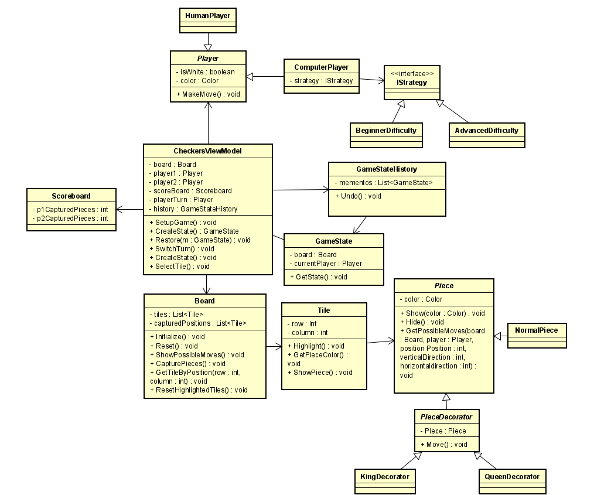

## Description

Het idee van deze opdracht is om een damspel te maken in C#. Het is de bedoeling om lokaal 1 tegen 1 te spelen. Belangrijk is dat alle damregels goed werken, zoals het neerzetten van stenen, het slaan van stenen en het veranderen van gewone stenen in koningen. Tijdens het spel wordt het aantal geslagen stenen bijgehouden op een scorebord. Daarnaast is het ook mogelijk om tegen de computer te spelen met een 'basic' moeilijkheid en eventueel nog een 'medium' moeilijkheid. Ook is het mogelijk om zetten ongedaan te maken.

## Requirements

Must have

- Volledig werkend dam spel
  - Simpel User interface
  - Lokaal multiplayer
  - Board resetten

Should have

- Scoreboard
- Laatste move(s) ongedaan maken

Could have

- Bord selectie
- Meerdere gamemodes
- Verschillende moeilijkheidsgraad
- Forceer slaan gamemode
- Leaderboard
-

Wont have

- Online multiplayer

## Design Pattern

**Memento**
Deze pattern gaat gebruikt worden om een move history bij te houden.
Hiermee kan de laatste move(s) ongedaan worden gemaakt en het bord gereset worden. Zonder deze pattern kan de gebruiker niet terug naar een vorige move. Zonder een memento is het lastig om deze functionaliteit te implementeren omdat je dan alle properties over moet kopieren.

**Observer**
Met de observer gaan we zorgen dat klassen zoals het scorebord en het bord niet aan elkaar gekoppeld zijn. De Game klasse regelt de relatie tussen de verschillende klassen zoals het bord, scoreboard en player. Hierdoor is de code makkelijker te onderhouden en uit te breiden.

**Object pool**
De object is voor verantwoordelijk voor het aanmaken en beheren van alle pieces. Dit is makkelijk omdat een damspel een vast aantal pieces heeft die eenmaal aangemaakt kunnen worden en zodra ze niet meer nodig zijn weggegooid worden uit het geheugen.

**Strategy**
De strategy wordt gebruikt voor het aanpassen van het algoritme van de computer op basis van de staat van de game.

**Decorator**
De decorator zorgt ervoor dat het mogelijk is om functionaliteit aan te passen tijdens runtime van een piece. Als deze bijvoorbeeld geüpgraded moet worden naar een kingpiece of queen piece.

## Class diagram

